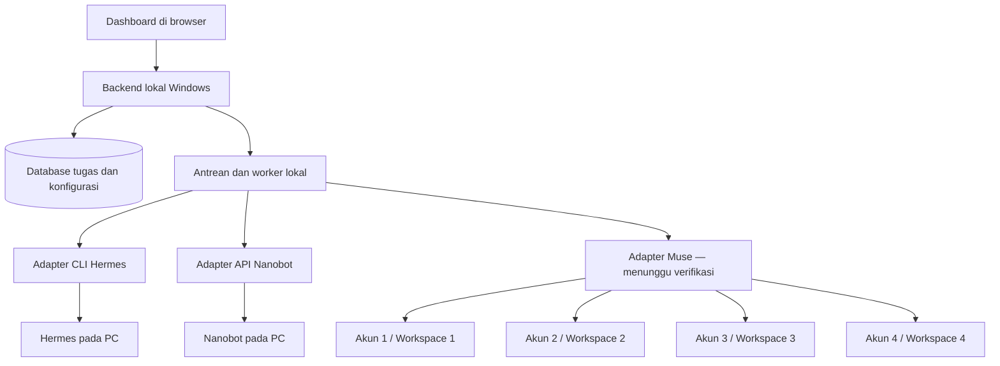

# Rencana Implementasi — Dashboard Multi-Agent

- Status: rencana untuk diskusi; implementasi belum dimulai
- Tanggal: 8 Oktober 2026
- Acuan: [PRD.md](PRD.md)

## 1. Hasil yang ingin dicapai

Satu aplikasi web pribadi untuk memilih salah satu dari enam koneksi, mengirim tugas, memantau status, dan membaca hasil dalam satu riwayat.

| Koneksi | Lingkungan | Pemisahan |
| --- | --- | --- |
| Muse 1 | https://muse.ai/, cloud | Akun 1 dan workspace 1 |
| Muse 2 | https://muse.ai/, cloud | Akun 2 dan workspace 2 |
| Muse 3 | https://muse.ai/, cloud | Akun 3 dan workspace 3 |
| Muse 4 | https://muse.ai/, cloud | Akun 4 dan workspace 4 |
| Hermes | PC Windows, dijalankan melalui CMD | Konfigurasi Hermes yang sudah digunakan |
| Nanobot | PC Windows, dijalankan melalui CMD | Konfigurasi Nanobot yang sudah digunakan |

Empat koneksi Muse harus mempunyai identitas, autentikasi, konteks, dan riwayat yang terpisah. Label Muse 1–4 adalah nama tampilan awal, bukan ID akun sebenarnya.

## 2. Batas pengerjaan awal

MVP mencakup inventaris koneksi, pengiriman tugas teks ke satu tujuan, antrean, status, hasil, riwayat, dan pengaturan koneksi. Semua enam koneksi tetap menjadi target produk.

Broadcast ke beberapa akun, penerusan otomatis antar-agent, penjadwalan, serta pengguna tim dikerjakan setelah MVP. Workspace Muse yang sudah ada tetap harus terpisah sejak MVP; ini berbeda dari fitur workspace tim dalam aplikasi dashboard.

Rencana ini tidak memulai instalasi, mengakses akun, atau menjalankan agent. Tahap implementasi dimulai pada permintaan berikutnya.

## 3. Arsitektur awal yang direkomendasikan

Dashboard dan backend berjalan di PC Windows pengguna, lalu dibuka melalui browser. Ini usulan dasar untuk penggunaan pribadi; akses dari luar PC menjadi keputusan deployment tersendiri.

Kandidat teknologi:

- Next.js dan TypeScript untuk dashboard serta backend.
- Worker Node.js terpisah untuk pekerjaan panjang dan pemanggilan proses lokal.
- SQLite untuk penyimpanan lokal satu pengguna, dengan antrean persisten dan transaksi pengambilan tugas. Ini alternatif yang lebih ringan daripada usulan PostgreSQL dalam PRD; keputusan final dilakukan pada tahap desain.
- SSE untuk pembaruan dari backend ke browser; polling ke platform bila diperlukan dan didukung.
- Penyimpanan kredensial Windows yang sesuai, dengan database hanya menyimpan referensinya.

Backend dibatasi ke loopback untuk rancangan lokal. PC harus menyala agar dashboard dan agent lokal tersedia. Jika kelak backend dipindah ke cloud, diperlukan penghubung keluar dari PC dan kajian ulang autentikasi, database, serta akses jaringan.

## 4. Tahapan dan hasil yang harus dibuktikan

### Tahap 1 — Verifikasi metode integrasi

Pekerjaan:

1. Catat versi, lokasi executable, direktori kerja, dan konfigurasi Hermes/Nanobot yang dipakai melalui CMD.
2. Cocokkan CLI Hermes dengan dokumentasi resmi, termasuk cara mendapatkan hasil, sesi, dan perilaku saat meminta persetujuan tool.
3. Pastikan versi Nanobot mempunyai API lokal yang didokumentasikan; bila tidak, evaluasi CLI resmi tanpa mengasumsikan upgrade diperlukan.
4. Verifikasi apakah Muse menyediakan API/SDK atau metode resmi lain yang dapat menjalankan jenis tugas yang dibutuhkan pengguna.
5. Petakan setiap akun Muse ke workspace yang benar, termasuk cakupan autentikasi dan batas penggunaan per akun.

Hasil: matriks kemampuan keenam koneksi dan satu contoh instruksi beserta hasil yang dapat diverifikasi untuk setiap jenis platform.

Kriteria selesai: metode pengiriman dan pengambilan hasil terbukti untuk setiap platform. Membaca dokumentasi saja belum merupakan bukti runtime.

Jika Muse hanya menyediakan akses web tanpa metode integrasi yang sesuai, dukungan pengiriman tugas Muse berstatus terhambat. Bagian lokal dapat terus dikembangkan, tetapi MVP enam koneksi belum dinyatakan selesai. Otomatisasi browser atau pengurangan cakupan memerlukan keputusan desain terpisah; tombol pembuka situs tidak dihitung sebagai integrasi tugas.

### Tahap 2 — Desain antarmuka dan data

Pekerjaan:

- Rancang dashboard berisi enam kartu koneksi dengan nama, platform, akun/workspace, dan kondisi terakhir.
- Rancang formulir tugas: tujuan, instruksi, dan pilihan sesi bila didukung.
- Rancang halaman detail tugas: status, hasil, waktu, serta tindakan yang tersedia.
- Rancang pengaturan dan riwayat dengan filter per koneksi.
- Finalisasi pilihan penyimpanan lokal dan kontrak adapter berdasarkan temuan tahap 1.

Hasil: wireframe, skema data, dan kontrak adapter. Gunakan `Connection`, `Task`, `TaskAttempt`, `TaskEvent`, serta referensi kredensial. Setiap tugas wajib mempunyai `connection_id`; identitas akun/workspace dicatat agar tujuan historis tetap dapat dilacak ketika label koneksi berubah.

Kriteria selesai: pengguna dapat membedakan empat akun Muse pada formulir dan riwayat tanpa bergantung pada warna saja. Fitur yang tidak didukung ditandai jelas.

### Tahap 3 — Fondasi aplikasi lokal

Pekerjaan:

- Siapkan proyek, autentikasi pemilik, database, migrasi, dan pengaturan koneksi.
- Implementasikan antrean persisten, worker, serta batas satu tugas aktif per koneksi sebagai nilai awal.
- Tambahkan pembaruan UI dan pencatatan peristiwa.
- Sediakan adapter simulasi untuk menguji UI dan antrean tanpa mengirim tugas nyata.

Hasil: dashboard lokal dapat menyimpan tugas, menampilkan progres simulasi, dan mempertahankan riwayat setelah restart.

Kriteria selesai: pengiriman ganda dari UI tidak membuat tugas ganda; data tidak hilang ketika worker dihentikan. Simulasi diberi label dan tidak dihitung sebagai agent yang sudah terintegrasi.

### Tahap 4 — Integrasi Hermes dan Nanobot

Hermes:

- Panggil executable yang sudah digunakan melalui API proses, dengan argumen terpisah atau stdin yang didukung.
- Tetapkan direktori kerja dan konteks konfigurasi secara eksplisit.
- Tangkap output dan status proses; verifikasi hasil semantik, bukan hanya exit code.
- Tangani permintaan input/persetujuan tanpa menyetujui otomatis.

Nanobot:

- Gunakan API lokal jika tersedia, termasuk pemeriksaan kesehatan dan pengiriman pesan.
- Beri `session_id` eksplisit agar tugas berbeda tidak menggunakan sesi default bersama.
- Petakan streaming dan hasil akhir ke kontrak tugas dashboard.
- Sesuaikan format pesan dengan batas API pada versi yang terpasang.

Hasil: tugas dari dashboard selesai melalui Hermes dan Nanobot yang sebenarnya di Windows.

Kriteria selesai: masing-masing dapat mengembalikan hasil; kegagalan salah satu tidak menghentikan koneksi lain. Pengujian di cloud Linux tidak menggantikan pengujian Windows ini.

### Tahap 5 — Integrasi empat akun Muse

Prasyarat: kelayakan integrasi Muse pada tahap 1 sudah terbukti.

Pekerjaan:

- Buat satu adapter platform yang menerima konfigurasi koneksi terpisah untuk setiap akun/workspace.
- Simpan referensi kredensial per koneksi dan isolasikan sesi, konteks, hasil, serta batas penggunaan.
- Tampilkan akun/workspace tujuan sebelum pengguna mengirim tugas.
- Petakan status dan hasil yang benar-benar disediakan Muse; jangan mengarang progres yang tidak tersedia.

Hasil: empat koneksi Muse dapat menerima instruksi secara mandiri melalui metode terverifikasi.

Kriteria selesai: pengiriman ke Muse 1 tidak memakai autentikasi atau workspace Muse 2–4. Kegagalan autentikasi satu akun hanya memengaruhi akun tersebut. Seluruh pengujian memakai tugas sederhana yang tidak mengubah data penting.

### Tahap 6 — Ketahanan dan validasi menyeluruh

Pekerjaan:

- Uji timeout pengiriman, koneksi terputus, aplikasi restart, serta pembaruan ganda atau tidak berurutan.
- Jangan mengirim ulang otomatis ketika tugas mungkin sudah diterima platform; gunakan rekonsiliasi atau status belum diketahui.
- Uji pembatalan hanya pada platform yang mempunyai mekanisme terverifikasi.
- Pastikan rahasia tidak masuk log, respons browser, atau prompt.
- Verifikasi isolasi sesi antar-tugas dan isolasi empat akun Muse.

Hasil: catatan pengujian per koneksi, daftar keterbatasan nyata, serta prosedur pemulihan.

Kriteria selesai: keenam koneksi lulus alur kirim–pantau–hasil; kegagalan dan status yang belum pasti ditampilkan jujur. Tugas aktif tidak dianggap aman diulang hanya karena worker restart.

### Tahap 7 — Paket penggunaan Windows

Pekerjaan:

- Buat panduan instalasi, konfigurasi, mulai, dan berhenti melalui CMD.
- Sediakan launcher dashboard dan worker dengan pemeriksaan kesiapan.
- Dokumentasikan pencadangan database dan pengelolaan kredensial tanpa mengekspor rahasia sebagai teks biasa.
- Verifikasi startup ulang menggunakan langkah yang sama dengan panduan.

Hasil: paket dan dokumentasi penggunaan lokal yang dapat dijalankan berulang.

Kriteria selesai: setelah aplikasi ditutup dan dibuka kembali, riwayat tersedia, koneksi diperiksa ulang, dan tugas tidak terkirim dua kali.

## 5. Urutan dependensi

Tahap 1 mendahului keputusan integrasi. Tahap 2 dan 3 membentuk fondasi. Tahap 4 serta 5 menggunakan fondasi tersebut dan dapat berjalan terpisah setelah metode masing-masing terbukti. Tahap 6 dan 7 menyatukan hasil menjadi aplikasi yang dapat digunakan.

Jika akses Muse belum tersedia, verifikasi agent lokal, desain, dan fondasi tetap dapat dilanjutkan saat implementasi diizinkan. Target empat akun Muse tetap tercatat sebagai pekerjaan yang belum selesai.

## 6. Keputusan yang ditunda sampai implementasi

- Metode resmi integrasi Muse dan jenis tugas yang dapat dijalankan.
- Versi serta lokasi executable Hermes/Nanobot yang terpasang.
- Dashboard lokal saja atau perlu akses dari luar PC; rekomendasi awal tetap lokal.
- Pilihan database final, retensi hasil, dan batas ukuran input.
- Mekanisme persetujuan tool bila diperlukan agent.

Tidak ada kredensial yang perlu diberikan dalam chat. Estimasi waktu baru dibuat setelah kelayakan Muse dan versi agent lokal diketahui.

## 7. Definisi selesai

- Satu dashboard web pribadi pada Windows.
- Empat akun dan empat workspace Muse terpisah, ditambah Hermes dan Nanobot.
- Pengguna bisa memilih tujuan, mengirim tugas, melihat status, dan membaca hasil nyata.
- Riwayat bertahan setelah restart dan tidak bercampur antar-koneksi.
- Pengujian Windows serta integrasi nyata selesai dan keterbatasan terdokumentasi.
- Panduan CMD dan startup ulang sudah diuji.

Dokumen ini merupakan rencana kerja. Belum ada klaim bahwa integrasi keenam koneksi sudah berjalan.
