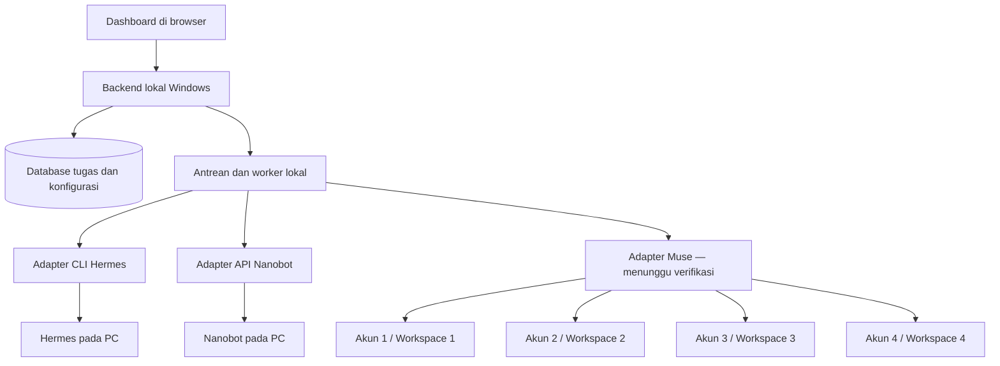

# PRD dan Rencana Implementasi — Dashboard Pengelolaan Multi-Agent

- Status: draf diskusi, belum disetujui untuk implementasi
- Versi: 0.6
- Tanggal: 8 Oktober 2026
- Nama produk: belum ditentukan
- Rencana implementasi: tercakup dalam bagian 20 dokumen ini.

## 1. Ringkasan

Aplikasi berbasis web untuk mengelola empat agent Muse.ai, satu Hermes, dan satu Nanobot melalui satu dashboard. Pengguna dapat memilih agent, mengirim instruksi, memantau pekerjaan, membaca hasil, dan meneruskan hasil ke agent pada platform lain.

Hermes telah diidentifikasi sebagai NousResearch/hermes-agent dan Nanobot sebagai HKUDS/nanobot. Dokumentasi upstream menyediakan kandidat integrasi CLI untuk Hermes dan API lokal untuk Nanobot. Versi yang terpasang di PC belum diketahui dan belum diuji. Pengguna menyebut muse.ai sebagai layanan cloud; dukungan pengendalian empat agent di layanan tersebut belum terverifikasi.

## 2. Kebutuhan yang sudah diketahui

- Antarmuka berbasis web.
- Inventaris awal terdiri dari enam agent: empat Muse.ai, satu Hermes, satu Nanobot.
- Empat koneksi Muse.ai merupakan empat akun dengan empat workspace berbeda, diakses melalui https://muse.ai/. Autentikasi, sesi, konteks, dan riwayat setiap koneksi harus terpisah.
- Hermes dan Nanobot dijalankan melalui CMD pada PC Windows pribadi pengguna. Rancangan awal mengikuti peluncuran dari CMD; lokasi executable dan konfigurasi diverifikasi saat implementasi.
- Hermes: NousResearch/hermes-agent, sesuai tautan dokumentasi CLI pengguna.
- Nanobot: HKUDS/nanobot, sesuai tautan repositori pengguna.
- Digunakan sendiri oleh pemilik.
- Prioritas MVP: satu dashboard untuk memilih agent dan mengirim tugas lintas platform.
- Diskusi dan penetapan kebutuhan mendahului implementasi.

## 3. Asumsi sementara

Asumsi berikut merupakan usulan untuk dibahas, bukan keputusan pengguna:

- Keenam agent sudah ada dan tetap berjalan di lingkungan masing-masing.
- Setiap agent diregistrasikan sebagai koneksi terpisah, termasuk empat agent yang memakai platform sama.
- Alur MVP berupa tugas ke satu agent. Penerusan hasil antarsistem diusulkan untuk tahap berikutnya.
- Pengguna mengakses dashboard melalui laptop; tampilan dasar tetap dapat digunakan di ponsel.
- Aplikasi tidak mengganti model atau runtime agent yang sudah digunakan.

## 4. Masalah dan tujuan

Pengguna perlu berpindah antarmuka untuk memberi instruksi kepada agent dari beberapa platform. Status, percakapan, dan hasil pekerjaan tersebar, sehingga sulit melacak siapa mengerjakan apa dan meneruskan konteks secara konsisten.

Tujuan produk:

1. Menyediakan daftar keenam agent beserta kemampuan dan kondisi koneksinya.
2. Menyediakan satu alur untuk mengirim tugas dan melihat progresnya.
3. Menjaga riwayat instruksi, hasil, dan hubungan antartugas.
4. Memungkinkan hasil satu agent digunakan sebagai input agent lain dengan kendali pengguna.
5. Menampilkan keterbatasan setiap platform secara jelas.

## 5. Batas MVP

### Termasuk

- Login pemilik dan pengaturan koneksi agent.
- Daftar agent, detail agent, dan pemeriksaan koneksi.
- Tugas berbasis teks kepada satu agent.
- Riwayat tugas dan pembaruan status.
- Hasil berupa teks serta referensi berkas apabila platform mendukungnya.
- Antrean tugas dan batas jumlah tugas bersamaan per agent.
- Pencatatan kegagalan, timeout, dan status yang belum dapat dipastikan.
- Pembatalan untuk platform yang mendukungnya.

### Tahap berikutnya

- Penerusan hasil secara manual ke agent pada platform lain.
- Pengiriman satu instruksi ke beberapa agent sekaligus dan perbandingan hasil.
- Workflow otomatis berurutan, percabangan, dan perulangan terbatas.
- Penjadwalan, notifikasi eksternal, dan pemilihan agent otomatis.
- Akun tim, pembagian peran, dan workspace tim dalam dashboard. Pemisahan empat workspace Muse sudah termasuk MVP.
- Penghitungan biaya jika data penggunaan tersedia dari penyedia.

### Di luar cakupan awal

- Melatih model atau membuat runtime agent baru.
- Mengelola provisioning mesin tempat agent berjalan.
- Menganggap semua agent dapat menjalankan perintah shell.
- Otomatisasi browser sebagai pengganti integrasi resmi tanpa kajian terpisah.
- Percakapan otonom antarseluruh agent tanpa batas langkah atau kendali pengguna.

Prioritas MVP sudah dikonfirmasi: memilih agent dan mengirim tugas. Cakupan integrasi Muse bergantung pada verifikasi antarmuka layanan tersebut.

## 6. Alur utama pengguna

### A. Menghubungkan agent

1. Pengguna menambahkan nama, platform, dan konfigurasi koneksi.
2. Pengguna memasukkan kredensial melalui formulir aman bila diperlukan.
3. Aplikasi memeriksa koneksi dan mencatat kemampuan yang didukung.
4. Agent muncul di dashboard dengan waktu pemeriksaan terakhir.

### B. Memberikan tugas

1. Pengguna memilih agent dan menuliskan instruksi.
2. Pengguna meninjau konteks atau hasil sebelumnya yang akan disertakan.
3. Aplikasi membuat tugas dan menempatkannya dalam antrean.
4. Adapter mengirim tugas dan menyimpan ID pekerjaan dari platform, jika tersedia.
5. Pengguna melihat status, pembaruan yang tersedia, dan hasil akhir.

### C. Meneruskan tugas lintas platform (tahap berikutnya)

Contoh ilustratif: Muse-1 menyusun bahan riset, Hermes mengolah hasil tersebut, lalu Nanobot menindaklanjuti instruksi yang dipilih pengguna. Peran ini hanya contoh, bukan kemampuan yang sudah diverifikasi.

1. Pengguna membuka hasil tugas yang sudah selesai.
2. Pengguna memilih tindakan “Teruskan ke agent”.
3. Pengguna memilih agent tujuan, bagian hasil yang disertakan, dan instruksi baru.
4. Aplikasi menampilkan pratinjau data yang akan dikirim.
5. Setelah pengguna mengirim, aplikasi membuat tugas baru yang terhubung ke tugas asal.

Konteks antarsistem dikirim sebagai data terpilih. Sesi internal dan memori platform tidak diasumsikan dapat dipindahkan langsung.

## 7. Kebutuhan fungsional dan kriteria penerimaan

| ID | Kebutuhan | Kriteria penerimaan |
| --- | --- | --- |
| FR-01 | Registrasi agent | Enam agent dapat disimpan sebagai identitas berbeda; mengubah satu koneksi tidak mengubah koneksi lain. |
| FR-02 | Pemeriksaan koneksi | Dashboard membedakan koneksi berhasil, gagal, belum diperiksa, dan informasi kedaluwarsa; menampilkan waktu pemeriksaan. |
| FR-03 | Kemampuan agent | Fitur pengiriman, streaming, berkas, pembatalan, dan pemeriksaan status mengikuti kemampuan adapter yang terverifikasi. |
| FR-04 | Pengiriman instruksi | Instruksi tersimpan sebelum pengiriman; pengguna dapat melihat agent tujuan, waktu, dan statusnya. |
| FR-05 | Antrean | Batas tugas bersamaan dapat ditetapkan per agent; tugas berikutnya menunggu saat batas tercapai. |
| FR-06 | Pemantauan | Status dapat diperbarui melalui webhook atau polling sesuai dukungan platform; hilangnya koneksi tidak ditampilkan sebagai keberhasilan. |
| FR-07 | Riwayat | Pengguna dapat mencari dan menyaring tugas berdasarkan agent, status, serta tanggal. |
| FR-08 | Handoff (tahap berikutnya) | Hasil terpilih dapat diteruskan ke platform lain; tugas baru menyimpan tautan ke tugas asal dan instruksi tambahan. |
| FR-09 | Penanganan kegagalan | Pesan kegagalan dapat dipahami dan membedakan koneksi, autentikasi, batas penggunaan, serta kegagalan pekerjaan. |
| FR-10 | Pembatalan | Tugas antrean dapat dibatalkan; pembatalan pekerjaan berjalan hanya dinyatakan berhasil setelah ada konfirmasi yang memadai. |
| FR-11 | Pencegahan duplikasi | Pengiriman ganda dari UI tidak membuat dua tugas; retry eksternal tidak dilakukan otomatis jika ada risiko tugas sudah diterima. |
| FR-12 | Audit | Pengiriman, perubahan koneksi, penerusan, retry, dan pembatalan tercatat tanpa menyimpan kredensial dalam log. |

## 8. Halaman aplikasi

### Dashboard

Ringkasan enam agent, kondisi koneksi, tugas aktif, antrean, dan kegagalan terbaru. Tombol utama: “Buat tugas”. Informasi yang tidak tersedia ditampilkan sebagai “Belum diketahui”.

### Agent

Daftar dan detail agent: nama, platform, deskripsi peran, kemampuan, kondisi koneksi, tugas terakhir, serta konfigurasi batas pekerjaan bersamaan.

### Tugas

Daftar tugas dengan filter. Halaman detail menampilkan instruksi, agent tujuan, lini waktu status, hasil, hubungan tugas asal/lanjutan, dan tindakan yang didukung.

### Pengaturan

Pengelolaan koneksi, kredensial, timeout, serta kebijakan penyimpanan riwayat. Nilai rahasia tidak dapat dibaca kembali melalui UI.

## 9. Rancangan integrasi

Satu backend menyediakan API internal yang konsisten. Adapter terpisah menerjemahkan operasi ke protokol masing-masing platform.

| Platform | Jumlah agent | Informasi yang perlu dikonfirmasi | Status |
| --- | --- | --- | --- |
| Muse.ai | 4 akun / 4 workspace, cloud | Contoh tugas, API, autentikasi per akun, model sesi | Identitas dan pemisahan akun/workspace dikonfirmasi; kemampuan integrasi belum diverifikasi |
| NousResearch/hermes-agent | 1, Windows | Versi terpasang, executable CMD, profil, format hasil dan persetujuan tool | CLI noninteraktif dan dukungan Windows didokumentasikan; belum diuji pada PC pengguna |
| HKUDS/nanobot | 1, Windows | Versi terpasang, executable CMD, ketersediaan plugin API | API lokal dan dukungan Windows didokumentasikan; belum diuji pada PC pengguna |

### Temuan dokumentasi dan pilihan adapter

**Hermes:** dokumentasi CLI mencantumkan `hermes chat -q "Hello"` untuk satu permintaan noninteraktif, serta `--query-file` untuk input dari berkas atau stdin. Kandidat MVP adalah worker lokal yang memanggil CLI menggunakan argumen proses terpisah, tanpa merangkai prompt menjadi perintah shell. Pengambilan hasil terstruktur, kelanjutan sesi, dan perilaku persetujuan tool harus diuji terhadap versi terpasang. Exit code saja belum cukup untuk membuktikan tugas pengguna berhasil. Jika agent menunggu persetujuan tool, dashboard perlu menampilkan kondisi menunggu pengguna; persetujuan tidak dilewati otomatis.

README Hermes saat diperiksa mendokumentasikan Windows native maupun WSL2. Pengguna mengonfirmasi peluncuran melalui CMD; adapter dirancang mengikuti executable dan konfigurasi yang digunakan dari CMD. Tidak ada kebutuhan WSL2 yang ditetapkan.

**Nanobot:** dokumentasi pada branch `main` mendokumentasikan plugin API, `nanobot serve`, endpoint `GET /health`, `GET /v1/models`, dan `POST /v1/chat/completions`. API secara default menggunakan loopback port 8900. Ini kandidat adapter utama; CLI menjadi opsi bila API tidak tersedia pada versi terpasang.

API Nanobot mendokumentasikan `session_id`, streaming SSE, dan tepat satu pesan `user` per permintaan. Adapter harus memberi ID sesi eksplisit agar tugas berbeda tidak bercampur dalam sesi default. Riwayat format OpenAI tidak boleh diteruskan begitu saja sebagai banyak pesan. Dokumentasi ini belum membuktikan dukungan pemulihan job atau pembatalan; keduanya perlu pemeriksaan tersendiri.

**Muse:** pengguna telah mengonfirmasi https://muse.ai/. Belum ada dasar untuk memilih endpoint atau metode autentikasi. Empat agent yang dimaksud pengguna adalah empat akun dengan empat workspace berbeda. Contoh tugas yang biasa dikirim dan akses API masih perlu diperjelas. Setiap koneksi harus menggunakan autentikasi serta konteks akun/workspace miliknya sendiri. Dukungan kontrol agent tidak boleh disimpulkan hanya dari alamat situs. Jangan mengganti identitas layanan dengan produk lain berdasarkan kemiripan nama.

### Topologi Windows yang diusulkan

Untuk pemakaian pribadi dari PC yang sama, dashboard lokal adalah usulan awal: browser → backend lokal → CLI Hermes/API Nanobot, serta backend → layanan Muse melalui jaringan. Jika akses di luar PC diperlukan, evaluasi hosting cloud dan bridge keluar dari PC. Pilihan ini belum disetujui pengguna.

Adapter lokal mengikuti konteks peluncuran CMD yang sudah digunakan: lokasi executable, direktori kerja, dan konfigurasi runtime dicatat saat pemeriksaan integrasi. Prompt dikirim melalui argumen proses atau stdin yang didukung, bukan disisipkan ke string `cmd /c`. Kredensial model yang sudah dikonfigurasi pada agent tetap digunakan melalui runtime tersebut. Tidak perlu meminta kunci model baru hanya untuk membuat dashboard.

Kontrak adapter yang diusulkan:

- `checkConnection`: menguji koneksi tanpa memulai pekerjaan.
- `getCapabilities`: mengembalikan operasi yang benar-benar didukung.
- `submitTask`: mengirim tugas dan mendapatkan tanda penerimaan.
- `getTaskStatus`: membaca status bila platform mendukungnya.
- `getTaskResult`: mengambil hasil.
- `cancelTask`: opsional, berdasarkan kemampuan platform.
- `receiveEvent`: opsional, menerima webhook atau event streaming.

Prioritas metode integrasi: API/SDK resmi, kemudian CLI resmi melalui proses terkontrol atau bridge dekat runtime. Jika agent hanya dapat diakses melalui UI, dukungan platform tersebut menjadi pertanyaan kelayakan, bukan fitur yang diasumsikan selesai.

Hermes dan Nanobot berjalan di PC Windows pribadi. Dua opsi deployment perlu dipertimbangkan:

1. Dashboard dan backend berjalan di PC yang sama: adapter lokal mengakses runtime agent dan adapter Muse menghubungi layanan cloud. Ini opsi awal yang lebih sederhana jika akses dari luar rumah tidak diperlukan.
2. Dashboard dan backend berjalan di cloud: bridge kecil di PC membuka koneksi keluar yang terautentikasi untuk mengambil tugas dan mengirim hasil. Metode ini perlu dibuktikan terhadap API/CLI agent yang sebenarnya.

Pilihan deployment belum diputuskan. Untuk kedua opsi, dashboard menampilkan waktu koneksi terakhir. Jika PC terputus, tugas baru ke agent lokal ditolak dengan penjelasan pada MVP agar tidak tiba-tiba dieksekusi ketika PC menyala kembali. Tugas yang sudah dikirim direkonsiliasi setelah koneksi pulih; pemutusan koneksi tidak membuktikan pekerjaan berhenti.

## 10. Siklus tugas dan keandalan

Status internal yang diusulkan: `queued`, `dispatching`, `running`, `succeeded`, `failed`, `cancel_requested`, `cancelled`, `waiting_for_user`, dan `unknown`.

- `succeeded` hanya digunakan setelah penyelesaian terkonfirmasi.
- `waiting_for_user` digunakan bila adapter dapat mendeteksi kebutuhan persetujuan atau input interaktif. Mekanisme melanjutkan pekerjaan harus dibuktikan; bila tidak tersedia, keterbatasan ini ditampilkan kepada pengguna.
- Timeout pengiriman dapat berarti tugas sudah diterima tetapi respons hilang. Kondisi ini masuk rekonsiliasi atau `unknown`, bukan langsung dikirim ulang.
- Timeout pemantauan tidak otomatis menghentikan agent di platform asal.
- Retry otomatis hanya untuk operasi yang aman atau ketika platform mendukung idempotensi.
- Restart backend memulihkan antrean dan memeriksa kembali pekerjaan berjalan dari data persisten.
- Pembaruan yang datang dua kali atau tidak berurutan diproses tanpa menggandakan tugas atau menimpa hasil akhir dengan status lama.
- Jika pembatalan tidak didukung, UI menjelaskan bahwa aplikasi tidak dapat menghentikan pekerjaan tersebut.

## 11. Data utama

| Entitas | Data utama |
| --- | --- |
| Agent | ID, nama, platform, konfigurasi nonrahasia, referensi kredensial, kemampuan, kondisi koneksi |
| Task | ID, agent tujuan, instruksi, konteks, status, ID eksternal, waktu, tugas asal |
| TaskAttempt | Percobaan pengiriman, kunci idempotensi jika didukung, respons penerimaan, kegagalan |
| TaskEvent | Perubahan status, sumber pembaruan, waktu platform, waktu diterima |
| Artifact | Teks hasil atau referensi berkas, tipe, ukuran, tugas sumber |
| AuditEvent | Aktor, tindakan, objek, waktu, ringkasan tanpa rahasia |

Retensi data dan batas ukuran konteks/berkas ditetapkan sebelum implementasi fitur penyimpanan. Riwayat penuh tidak otomatis disertakan ke setiap tugas baru.

## 12. Keamanan dan kendali akses

- Dashboard menggunakan autentikasi, termasuk bila hanya ada satu pengguna.
- Kredensial disimpan di sisi server melalui penyimpanan rahasia atau enkripsi yang sesuai lingkungan deployment.
- Kredensial tidak dikirim ke browser atau dimasukkan ke prompt agent.
- Koneksi eksternal menggunakan HTTPS bila tersedia; webhook diverifikasi sesuai mekanisme platform.
- Endpoint koneksi hanya dapat dikonfigurasi pemilik; backend membatasi tujuan jaringan yang dapat diakses adapter.
- Hasil agent dirender sebagai konten tidak tepercaya dan tidak dieksekusi sebagai skrip atau perintah backend.
- Pengiriman tugas adalah instruksi kepada agent, bukan izin umum menjalankan shell pada server dashboard.
- Saat fitur handoff ditambahkan, data hanya diteruskan ke agent lain setelah tindakan eksplisit pengguna.

## 13. Arsitektur dan opsi teknologi

Arsitektur awal: browser → backend → antrean/worker → adapter platform → agent. Database menyimpan konfigurasi nonrahasia, tugas, dan riwayat. Pembaruan UI menggunakan SSE atau polling; protokol akhir mengikuti kebutuhan nyata.

Usulan teknologi, belum diputuskan:

- Frontend: Next.js dan TypeScript.
- Backend serta worker: TypeScript agar kontrak adapter konsisten.
- Database: SQLite diusulkan dalam rencana implementasi pada bagian 20 untuk aplikasi lokal satu pengguna; PostgreSQL tetap menjadi opsi jika kebutuhan deployment membenarkannya. Pilihan final ditentukan pada tahap desain.
- Deployment: satu server/container stack pada tahap awal, setelah lokasi agent dan kebutuhan jaringan diketahui.

Jika SDK utama agent lebih matang di Python, worker Python dapat dipilih. Pemilihan stack dilakukan setelah pemeriksaan integrasi, agar tidak menambah komponen tanpa kebutuhan.

## 14. Sasaran kualitas

Sasaran awal berikut perlu diuji; belum merupakan hasil pengukuran:

- Halaman utama dan riwayat merespons dalam dua detik pada beban enam agent dan sekitar 1.000 tugas tersimpan.
- Dengan event streaming, pembaruan ditampilkan dalam dua detik setelah diterima backend.
- Untuk polling, interval awal 5–15 detik disesuaikan dengan rate limit penyedia.
- Tugas yang sudah diterima aplikasi tetap tercatat setelah backend restart.
- Kegagalan satu adapter tidak menghentikan pekerjaan agent lain.
- Tidak ada target waktu selesai untuk pekerjaan agent sebelum karakteristik platform diketahui.

## 15. Validasi sebelum dinyatakan selesai

1. Catat versi, executable, dan konfigurasi Hermes/Nanobot yang digunakan melalui CMD, serta metode integrasi Muse; cocokkan kemampuan dokumentasi dengan versi terpasang.
2. Hubungkan satu agent per platform dan buktikan instruksi sederhana menghasilkan respons yang dapat diambil.
3. Registrasikan empat Muse.ai secara terpisah dan pastikan tugas diterima agent yang dipilih.
4. Jalankan tugas melalui dashboard pada keenam agent.
5. Putuskan koneksi PC dan pastikan agent lokal ditampilkan tidak tersedia serta pengiriman baru ditolak dengan penjelasan. Uji handoff dan hubungan riwayat pada tahap berikutnya.
6. Uji kredensial salah, koneksi terputus, timeout pengiriman, event duplikat, dan restart worker.
7. Uji pembatalan hanya pada adapter yang mendukungnya; cek tampilan keterbatasan pada adapter lainnya.
8. Pastikan kredensial tidak muncul di browser, log, atau hasil ekspor.

Pengujian dengan adapter simulasi digunakan untuk pengembangan, tetapi tidak menggantikan bukti integrasi nyata. MVP yang mencakup semua platform belum selesai jika salah satu platform wajib belum dapat menerima tugas dan mengembalikan hasil.

## 16. Tahapan pengerjaan

Rincian tahapan, dependensi, hasil, dan kriteria penerimaan tersedia pada bagian 20. Implementasi belum dimulai.

## 17. Pertanyaan diskusi

Pertanyaan penentu ruang lingkup:

1. Apa contoh tugas yang biasa diberikan pada masing-masing akun/workspace Muse?
2. Bagaimana pengguna memberi perintah kepada masing-masing agent saat ini?
3. Apa versi Hermes dan Nanobot yang terpasang? Ketersediaan CLI/API perlu dicocokkan dengan versi tersebut.
4. Saat masuk tahap implementasi, apa perintah peluncuran dan lokasi executable Hermes/Nanobot yang digunakan di CMD? Jangan menyertakan kredensial.
5. Apakah dashboard cukup diakses dari PC/jaringan rumah, atau perlu dapat dibuka dari luar?

Pertanyaan lanjutan setelah integrasi jelas:

- Apa peran masing-masing agent dan satu contoh pekerjaan nyata yang ingin dipermudah?
- Apakah tugas perlu berkas, akses repositori, atau hanya teks?
- Apakah dashboard akan dijalankan lokal, di VPS, atau layanan hosting tertentu?
- Apakah ada tindakan yang perlu persetujuan sebelum agent menjalankannya?
- Berapa lama riwayat dan hasil pekerjaan perlu disimpan?

## 18. Status keputusan

Belum ada implementasi aplikasi atau konfigurasi integrasi yang disetujui. Dokumen ini adalah dasar diskusi; jawaban pengguna akan digunakan untuk mengubah asumsi menjadi kebutuhan final.

## 19. Sumber dan batas verifikasi

Diperiksa pada 8 Oktober 2026, hanya untuk riset PRD:

- [Dokumentasi CLI Hermes dari pengguna](https://hermes-agent.nousresearch.com/docs/user-guide/cli). Situs dokumentasi ditolak proxy jaringan lingkungan ini; isi dokumentasi dibaca melalui [sumber resmi di GitHub](https://github.com/NousResearch/hermes-agent/blob/main/website/docs/user-guide/cli.md).
- [README resmi Hermes](https://github.com/NousResearch/hermes-agent/blob/main/README.md): mode instalasi Windows native dan WSL2.
- [Repositori Nanobot dari pengguna](https://github.com/HKUDS/nanobot): dukungan Windows dan jalur integrasi.
- [Dokumentasi API Nanobot](https://github.com/HKUDS/nanobot/blob/main/docs/openai-api.md): endpoint, sesi, batas pesan, dan streaming.
- [Muse.ai](https://muse.ai): disebut pengguna; akses situs ditolak proxy jaringan lingkungan ini, sehingga kemampuan integrasinya belum dapat diverifikasi.

Dokumentasi branch `main` dapat berubah dan berbeda dari rilis yang terpasang. Belum ada instalasi, eksekusi agent, akses PC pengguna, atau pengujian integrasi nyata. Pemeriksaan jaringan yang gagal tidak membuktikan layanan Muse tidak menyediakan API.

## 20. Rencana implementasi terperinci

### 20.1. Hasil yang ingin dicapai

Satu aplikasi web pribadi untuk memilih salah satu dari enam koneksi, mengirim tugas, memantau status, dan membaca hasil dalam satu riwayat.

| Koneksi | Lingkungan | Pemisahan |
| --- | --- | --- |
| Muse 1 | https://muse.ai/, cloud | Akun 1 dan workspace 1 |
| Muse 2 | https://muse.ai/, cloud | Akun 2 dan workspace 2 |
| Muse 3 | https://muse.ai/, cloud | Akun 3 dan workspace 3 |
| Muse 4 | https://muse.ai/, cloud | Akun 4 dan workspace 4 |
| Hermes | PC Windows, dijalankan melalui CMD | Konfigurasi Hermes yang sudah digunakan |
| Nanobot | PC Windows, dijalankan melalui CMD | Konfigurasi Nanobot yang sudah digunakan |

Empat koneksi Muse harus mempunyai identitas, autentikasi, konteks, dan riwayat yang terpisah. Label Muse 1–4 adalah nama tampilan awal, bukan ID akun sebenarnya.

### 20.2. Batas pengerjaan awal

MVP mencakup inventaris koneksi, pengiriman tugas teks ke satu tujuan, antrean, status, hasil, riwayat, dan pengaturan koneksi. Semua enam koneksi tetap menjadi target produk.

Broadcast ke beberapa akun, penerusan otomatis antar-agent, penjadwalan, serta pengguna tim dikerjakan setelah MVP. Workspace Muse yang sudah ada tetap harus terpisah sejak MVP; ini berbeda dari fitur workspace tim dalam aplikasi dashboard.

Rencana ini tidak memulai instalasi, mengakses akun, atau menjalankan agent. Tahap implementasi dimulai pada permintaan berikutnya.

### 20.3. Arsitektur awal yang direkomendasikan

Dashboard dan backend berjalan di PC Windows pengguna, lalu dibuka melalui browser. Ini usulan dasar untuk penggunaan pribadi; akses dari luar PC menjadi keputusan deployment tersendiri.

Kandidat teknologi:

- Next.js dan TypeScript untuk dashboard serta backend.
- Worker Node.js terpisah untuk pekerjaan panjang dan pemanggilan proses lokal.
- SQLite untuk penyimpanan lokal satu pengguna, dengan antrean persisten dan transaksi pengambilan tugas. Ini alternatif yang lebih ringan daripada opsi PostgreSQL pada bagian 13; keputusan final dilakukan pada tahap desain.
- SSE untuk pembaruan dari backend ke browser; polling ke platform bila diperlukan dan didukung.
- Penyimpanan kredensial Windows yang sesuai, dengan database hanya menyimpan referensinya.

Backend dibatasi ke loopback untuk rancangan lokal. PC harus menyala agar dashboard dan agent lokal tersedia. Jika kelak backend dipindah ke cloud, diperlukan penghubung keluar dari PC dan kajian ulang autentikasi, database, serta akses jaringan.

### 20.4. Tahapan dan hasil yang harus dibuktikan

#### Tahap 1 — Verifikasi metode integrasi

Pekerjaan:

1. Catat versi, lokasi executable, direktori kerja, dan konfigurasi Hermes/Nanobot yang dipakai melalui CMD.
2. Cocokkan CLI Hermes dengan dokumentasi resmi, termasuk cara mendapatkan hasil, sesi, dan perilaku saat meminta persetujuan tool.
3. Pastikan versi Nanobot mempunyai API lokal yang didokumentasikan; bila tidak, evaluasi CLI resmi tanpa mengasumsikan upgrade diperlukan.
4. Verifikasi apakah Muse menyediakan API/SDK atau metode resmi lain yang dapat menjalankan jenis tugas yang dibutuhkan pengguna.
5. Petakan setiap akun Muse ke workspace yang benar, termasuk cakupan autentikasi dan batas penggunaan per akun.

Hasil: matriks kemampuan keenam koneksi dan satu contoh instruksi beserta hasil yang dapat diverifikasi untuk setiap jenis platform.

Kriteria selesai: metode pengiriman dan pengambilan hasil terbukti untuk setiap platform. Membaca dokumentasi saja belum merupakan bukti runtime.

Jika Muse hanya menyediakan akses web tanpa metode integrasi yang sesuai, dukungan pengiriman tugas Muse berstatus terhambat. Bagian lokal dapat terus dikembangkan, tetapi MVP enam koneksi belum dinyatakan selesai. Otomatisasi browser atau pengurangan cakupan memerlukan keputusan desain terpisah; tombol pembuka situs tidak dihitung sebagai integrasi tugas.

#### Tahap 2 — Desain antarmuka dan data

Pekerjaan:

- Rancang dashboard berisi enam kartu koneksi dengan nama, platform, akun/workspace, dan kondisi terakhir.
- Rancang formulir tugas: tujuan, instruksi, dan pilihan sesi bila didukung.
- Rancang halaman detail tugas: status, hasil, waktu, serta tindakan yang tersedia.
- Rancang pengaturan dan riwayat dengan filter per koneksi.
- Finalisasi pilihan penyimpanan lokal dan kontrak adapter berdasarkan temuan tahap 1.

Hasil: wireframe, skema data, dan kontrak adapter. Gunakan `Connection`, `Task`, `TaskAttempt`, `TaskEvent`, serta referensi kredensial. Setiap tugas wajib mempunyai `connection_id`; identitas akun/workspace dicatat agar tujuan historis tetap dapat dilacak ketika label koneksi berubah.

Kriteria selesai: pengguna dapat membedakan empat akun Muse pada formulir dan riwayat tanpa bergantung pada warna saja. Fitur yang tidak didukung ditandai jelas.

#### Tahap 3 — Fondasi aplikasi lokal

Pekerjaan:

- Siapkan proyek, autentikasi pemilik, database, migrasi, dan pengaturan koneksi.
- Implementasikan antrean persisten, worker, serta batas satu tugas aktif per koneksi sebagai nilai awal.
- Tambahkan pembaruan UI dan pencatatan peristiwa.
- Sediakan adapter simulasi untuk menguji UI dan antrean tanpa mengirim tugas nyata.

Hasil: dashboard lokal dapat menyimpan tugas, menampilkan progres simulasi, dan mempertahankan riwayat setelah restart.

Kriteria selesai: pengiriman ganda dari UI tidak membuat tugas ganda; data tidak hilang ketika worker dihentikan. Simulasi diberi label dan tidak dihitung sebagai agent yang sudah terintegrasi.

#### Tahap 4 — Integrasi Hermes dan Nanobot

Hermes:

- Panggil executable yang sudah digunakan melalui API proses, dengan argumen terpisah atau stdin yang didukung.
- Tetapkan direktori kerja dan konteks konfigurasi secara eksplisit.
- Tangkap output dan status proses; verifikasi hasil semantik, bukan hanya exit code.
- Tangani permintaan input/persetujuan tanpa menyetujui otomatis.

Nanobot:

- Gunakan API lokal jika tersedia, termasuk pemeriksaan kesehatan dan pengiriman pesan.
- Beri `session_id` eksplisit agar tugas berbeda tidak menggunakan sesi default bersama.
- Petakan streaming dan hasil akhir ke kontrak tugas dashboard.
- Sesuaikan format pesan dengan batas API pada versi yang terpasang.

Hasil: tugas dari dashboard selesai melalui Hermes dan Nanobot yang sebenarnya di Windows.

Kriteria selesai: masing-masing dapat mengembalikan hasil; kegagalan salah satu tidak menghentikan koneksi lain. Pengujian di cloud Linux tidak menggantikan pengujian Windows ini.

#### Tahap 5 — Integrasi empat akun Muse

Prasyarat: kelayakan integrasi Muse pada tahap 1 sudah terbukti.

Pekerjaan:

- Buat satu adapter platform yang menerima konfigurasi koneksi terpisah untuk setiap akun/workspace.
- Simpan referensi kredensial per koneksi dan isolasikan sesi, konteks, hasil, serta batas penggunaan.
- Tampilkan akun/workspace tujuan sebelum pengguna mengirim tugas.
- Petakan status dan hasil yang benar-benar disediakan Muse; jangan mengarang progres yang tidak tersedia.

Hasil: empat koneksi Muse dapat menerima instruksi secara mandiri melalui metode terverifikasi.

Kriteria selesai: pengiriman ke Muse 1 tidak memakai autentikasi atau workspace Muse 2–4. Kegagalan autentikasi satu akun hanya memengaruhi akun tersebut. Seluruh pengujian memakai tugas sederhana yang tidak mengubah data penting.

#### Tahap 6 — Ketahanan dan validasi menyeluruh

Pekerjaan:

- Uji timeout pengiriman, koneksi terputus, aplikasi restart, serta pembaruan ganda atau tidak berurutan.
- Jangan mengirim ulang otomatis ketika tugas mungkin sudah diterima platform; gunakan rekonsiliasi atau status belum diketahui.
- Uji pembatalan hanya pada platform yang mempunyai mekanisme terverifikasi.
- Pastikan rahasia tidak masuk log, respons browser, atau prompt.
- Verifikasi isolasi sesi antar-tugas dan isolasi empat akun Muse.

Hasil: catatan pengujian per koneksi, daftar keterbatasan nyata, serta prosedur pemulihan.

Kriteria selesai: keenam koneksi lulus alur kirim–pantau–hasil; kegagalan dan status yang belum pasti ditampilkan jujur. Tugas aktif tidak dianggap aman diulang hanya karena worker restart.

#### Tahap 7 — Paket penggunaan Windows

Pekerjaan:

- Buat panduan instalasi, konfigurasi, mulai, dan berhenti melalui CMD.
- Sediakan launcher dashboard dan worker dengan pemeriksaan kesiapan.
- Dokumentasikan pencadangan database dan pengelolaan kredensial tanpa mengekspor rahasia sebagai teks biasa.
- Verifikasi startup ulang menggunakan langkah yang sama dengan panduan.

Hasil: paket dan dokumentasi penggunaan lokal yang dapat dijalankan berulang.

Kriteria selesai: setelah aplikasi ditutup dan dibuka kembali, riwayat tersedia, koneksi diperiksa ulang, dan tugas tidak terkirim dua kali.

### 20.5. Urutan dependensi

Tahap 1 mendahului keputusan integrasi. Tahap 2 dan 3 membentuk fondasi. Tahap 4 serta 5 menggunakan fondasi tersebut dan dapat berjalan terpisah setelah metode masing-masing terbukti. Tahap 6 dan 7 menyatukan hasil menjadi aplikasi yang dapat digunakan.

Jika akses Muse belum tersedia, verifikasi agent lokal, desain, dan fondasi tetap dapat dilanjutkan saat implementasi diizinkan. Target empat akun Muse tetap tercatat sebagai pekerjaan yang belum selesai.

### 20.6. Keputusan yang ditunda sampai implementasi

- Metode resmi integrasi Muse dan jenis tugas yang dapat dijalankan.
- Versi serta lokasi executable Hermes/Nanobot yang terpasang.
- Dashboard lokal saja atau perlu akses dari luar PC; rekomendasi awal tetap lokal.
- Pilihan database final, retensi hasil, dan batas ukuran input.
- Mekanisme persetujuan tool bila diperlukan agent.

Tidak ada kredensial yang perlu diberikan dalam chat. Estimasi waktu baru dibuat setelah kelayakan Muse dan versi agent lokal diketahui.

### 20.7. Definisi selesai

- Satu dashboard web pribadi pada Windows.
- Empat akun dan empat workspace Muse terpisah, ditambah Hermes dan Nanobot.
- Pengguna bisa memilih tujuan, mengirim tugas, melihat status, dan membaca hasil nyata.
- Riwayat bertahan setelah restart dan tidak bercampur antar-koneksi.
- Pengujian Windows serta integrasi nyata selesai dan keterbatasan terdokumentasi.
- Panduan CMD dan startup ulang sudah diuji.

Dokumen ini merupakan rencana kerja. Belum ada klaim bahwa integrasi keenam koneksi sudah berjalan.
